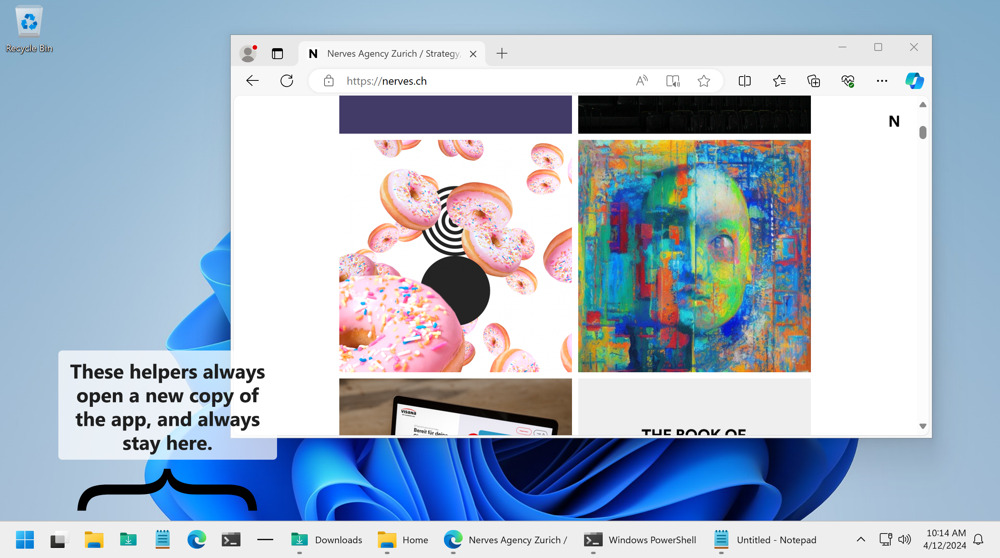

# Windows Taskbar Helpers

A free utility to make the Windows 11 Taskbar just a little bit more useful by allowing you to pin quick launchers that always open a new folder, app or anything.

## Features

* Add quick launchers to your Taskbar
* No Windows Patching required
* Create and add custom launchers
* Custom icons
* Very simple and lightweight

## Demo Video

## Getting Started

* Download the ZIP or use the installer
* Unpin any apps you already have pinned to the Taskbar
* From the Apps folder, just drag in any of the helpers you would like to use

## Custom Helpers

TODO

## Donate

Do you like Windows Taskbar Helpers? 

[Donate via PayPal](https://www.paypal.com/donate/?hosted_button_id=BG5FYMAHFG9V6)

## Why Windows Taskbar Helpers?

### The Problem
While Windows 11 is a welcome improvement in the general usability and tidyness for the Windows OS, it does have some small annoyances for power users. For many, its the way that the new taskbar works: pinned apps typically open and expand, not allowing for launching multiple copies of the app. This is specifically annoying if you want to for example pin different folders, and you would like a press on the Downloads pin to always open a new window with your Downloads.

### The Solution
This repository provides a wide series of little faux apps you can pin to your Taskbar with one promise: they will always open a new copy and will never register as open/expanded. Thus, if you add them to our Taskbar, you can create a series of shortcuts and tools. All the common apps and shortcuts for Windows are included, but you can also easily create your own.

### How it Works
It's very simple: the Windows Taskbar groups launchers by the executable that is assigned to it. Windows Taskbar Helpers overcomes this by creating little apps (executables) that do nothing other than launch their intended apps, thus they never get expanded in the Taskbar, since they immediately close after launching their app. This is why Windows Taskbar Helpers doesn't need to patch Windows and is always compatible.
